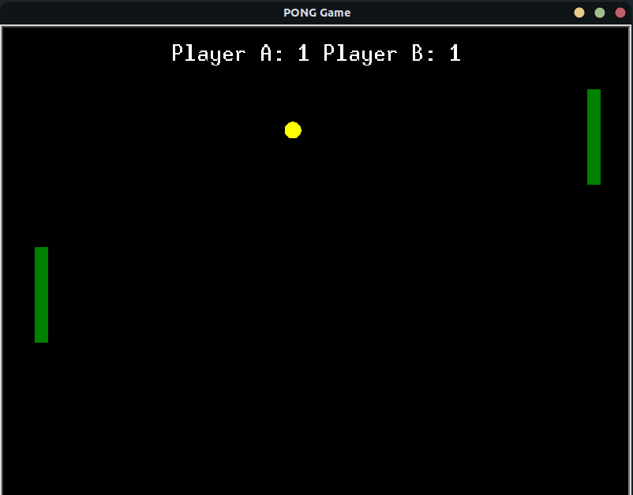

# Pong
Made a basic version of the classic Pong game using **turtle** module in python <br />


## Game instructions:
* Use **W** and **S** keys to control Player A
* Use **Up** and **Down** arrow keys to control Player B
* First player to reach 10 points wins


## To Play the Game:
For Linux : <br />
* Make sure that you have python3 installed in your system

* Install the tkinter module for python using pip <br />
      ```  pip install tk```

* Clone this repository <br />
   ```  git clone https://github.com/Shambu-K/Pong-game.git```
   
* Run the python file <br />
   ```  python3 pong.py```

* Alternatively, you can generate the executable by running the following commands <br />
      ```  pip install pyinstaller``` <br />
      ```  pyinstaller --onefile -w pong.py``` 
* The executable created will be present in the **dist** directory. Copy it to the main(**Pong-game**) directory and launch it.


